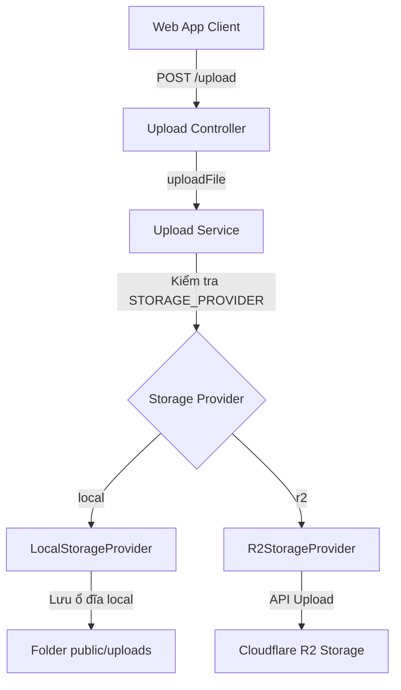

# Hướng dẫn tính năng: Tải lên & Lưu trữ Đa phương tiện (Media Upload & Storage)

Hệ thống cung cấp dịch vụ tải ảnh và video trực tiếp từ máy tính/thiết bị di động của người dùng lên máy chủ hoặc đám mây thông qua mô hình **Storage Provider (Nhà cung cấp Lưu trữ linh hoạt)**.

---

## 🏗️ Kiến trúc thiết kế (Storage Provider Pattern)

Mã nguồn backend NestJS được trừu tượng hóa qua interface `StorageProvider` để cho phép hệ thống dễ dàng hoán đổi nơi lưu trữ tệp tin mà không cần thay đổi code nghiệp vụ ở controllers/services:



### 1. Local Storage Provider (Lưu trữ cục bộ)
* **Cấu hình:** `STORAGE_PROVIDER=local`
* **Nguyên lý hoạt động:**
  * File được tải lên sẽ ghi trực tiếp vào thư mục vật lý `public/uploads/` tại thư mục chạy dự án.
  * Ứng dụng NestJS sử dụng Express static middleware để phục vụ các file này công khai dưới dạng URL: `<STORAGE_LOCAL_BASE_URL>/<tên_file>`.
  * **Chi phí: 0 USD/tháng**. Hoàn toàn miễn phí, không yêu cầu thiết lập tài khoản cloud, cực kỳ phù hợp cho môi trường phát triển (Local Development) và giai đoạn chạy thử nghiệm ban đầu (Prototyping).

### 2. Cloudflare R2 Storage Provider (Lưu trữ Đám mây R2)
* **Cấu hình:** `STORAGE_PROVIDER=r2`
* **Nguyên lý hoạt động:**
  * File tải lên sẽ được truyền thẳng lên Cloudflare R2 thông qua AWS S3 SDK.
  * R2 cung cấp băng thông truyền dữ liệu ra (egress bandwidth) **miễn phí 100%** và dung lượng lưu trữ miễn phí hào phóng lên tới **10GB/tháng**.
  * Rất phù hợp khi hệ thống bắt đầu có lượng người dùng thực tế hoạt động nhiều, giúp giảm tải dung lượng ổ cứng cho server ứng dụng.

---

## 📡 Chi tiết API Tải lên (`/api/v1/upload`)

Hệ thống cung cấp một API chung cho việc tải ảnh và video:

* **Đường dẫn:** `POST /api/v1/upload`
* **Quyền hạn:** Đã đăng nhập (Yêu cầu gửi kèm Token JWT)
* **Định dạng Request:** `multipart/form-data`
  * Body chứa một trường duy nhất tên là `file` chứa dữ liệu tệp tin.

### 🛡️ Cơ chế Ràng buộc & Bảo mật (MIME & Size Validations)
Hệ thống tự động phân loại tệp và thực thi các giới hạn:
1. **Đối với hình ảnh:**
   * Các loại MIME được phép: `image/jpeg`, `image/png`, `image/webp`, `image/gif`, `image/svg+xml`.
   * Dung lượng tối đa: **10MB**.
   * File được lưu trong thư mục con `images/`.
2. **Đối với video:**
   * Các loại MIME được phép: `video/mp4`, `video/quicktime`, `video/webm`.
   * Dung lượng tối đa: **100MB**.
   * File được lưu trong thư mục con `videos/`.

---

## ⚙️ Hướng dẫn Cấu hình trong `.env`

Để thiết lập hoặc hoán đổi giữa lưu trữ local và cloud, mở file `.env` và thay đổi các cấu hình sau:

### Chạy Local (Mặc định)
```env
STORAGE_PROVIDER=local
STORAGE_LOCAL_BASE_URL=http://localhost:3000/uploads
```

### Chạy Cloudflare R2
```env
STORAGE_PROVIDER=r2
R2_ACCOUNT_ID=mã_tài_khoản_cloudflare_của_bạn
R2_ACCESS_KEY_ID=mã_r2_access_key
R2_SECRET_ACCESS_KEY=mã_r2_secret_access_key
R2_BUCKET=tên_bucket_của_bạn
R2_PUBLIC_BASE_URL=https://pub-mã_bucket.r2.dev
```
*(Nếu bạn cấu hình custom domain cho R2 bucket, điền tên miền đó vào `R2_PUBLIC_BASE_URL`)*
